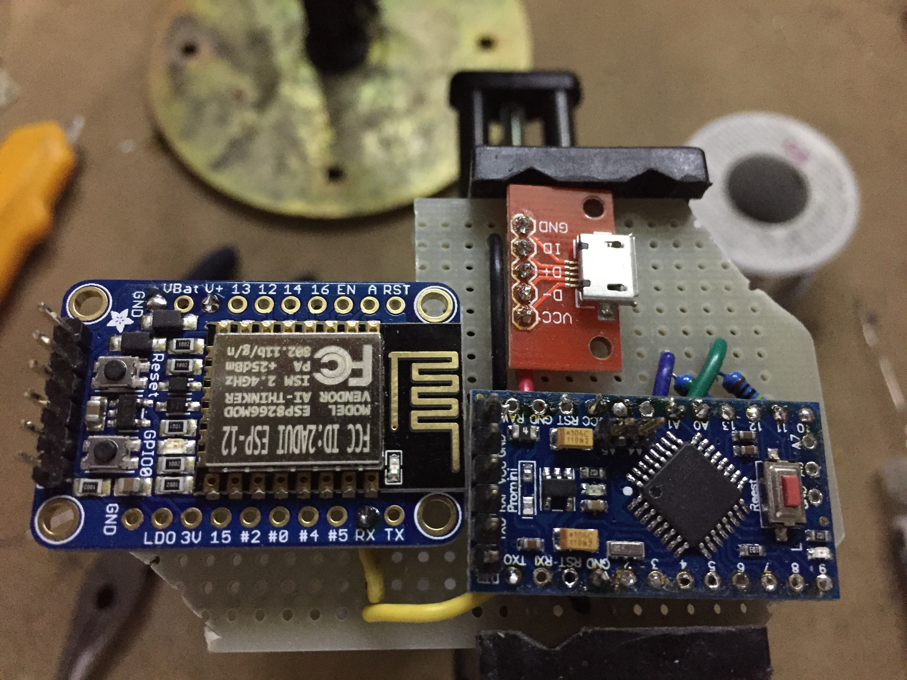

# Internet of Things smoker temperature probe 

### Description

Food and pit probes are sensed via voltage dividers by an Arduino Pro Mini on its A0 and A1 pins.  The data is serialized in JSON to the ESP8266 via serial UART.

The ESP8266 hosts a captive portal and serves via smoker.local.

### Electrical

Nothing special.  A power rail provides 5V to the ESP8266 (Adafruit Huzzah) and Arduino Pro Mini eBay knockoff.

Schottky diodes protect the VCC pins of the microcontrollers so that each can be powered and programmed individually without current leaking back into the other microcontroller, or worse, out of the USB plug.

### Arduino

The Steinhart algorithm implementation was lifted and tweaked from an Adafruit tutorial.

Pin A0 senses a 1MOhm food probe.

Pin A1 senses a 43kOHm-ish food probe.

TX is wired to ESP8266's RX.

### ESP8266

RX is wired to the Arduino's TX.

WiFiManager hosts a captive portal on the SSID 'smoker' so that it can be reconfigured to connect to any Wi-Fi network.

Once the sketch connects to a network, it will be available on the mDNS 'smoker.local'.

Web resources (data directory) are stored on and served out of SPIFFS.

### Resources

* [jQuery thermometer] (https://github.com/davedupplaw/jquery.thermometer)
* [Using a Thermistor] (https://learn.adafruit.com/thermistor/using-a-thermistor)
